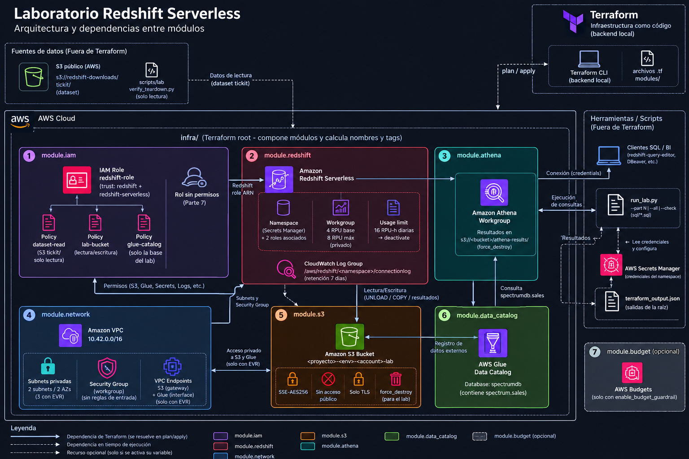

# Laboratorio Redshift — Sesión 5

Laboratorio de **Amazon Redshift Serverless** sobre el dataset TICKIT, pensado para que cada alumno lo despliegue en su propia
cuenta de AWS, lo recorra en la consola y lo destruya por completo al terminar. Toda la infraestructura se maneja con Terraform.



## De qué va la solución

### La pregunta que responde

La sesión busca que el alumno pueda contestar: **¿cuándo usaría S3, Athena, un Lakehouse o Redshift dentro de una arquitectura de
datos?** No se explica con slides: se **ve** corriendo las mismas preguntas de negocio sobre el mismo dato en motores distintos.

### El caso

TICKIT es el dataset de ejemplo oficial de AWS para Redshift: las ventas de entradas para eventos de una empresa ficticia
(7 tablas: una de hechos, `sales`, con unas 172.000 ventas, y seis dimensiones). El dato ya está en un **bucket público de S3**, es decir, en un
Data Lake. A partir de ahí el laboratorio muestra qué pasa cuando ese dato:

| Parte | Qué se hace | Qué enseña |
|---|---|---|
| 1 | `COPY` desde S3 hacia Redshift | Carga **paralela** y autorizada con un rol IAM, sin claves en el SQL |
| 2 | Consulta sobre el modelo en estrella | Hechos al centro, dimensiones alrededor |
| 3 | Agregación por mes y categoría | El tipo de consulta **recurrente** de BI que justifica un Data Warehouse |
| 4 | La misma pregunta en Athena y en Redshift | Se diferencian por **modelo de costo y de carga de trabajo**, no por velocidad |
| 5 | `UNLOAD` de Redshift a S3 en Parquet | Redshift también **produce** datos hacia el lake |
| 6 | Redshift Spectrum | Consultar S3 **sin cargarlo**, y combinarlo con lo ya cargado |
| 7 *(opcional)* | `COPY` con un rol sin permisos | Cómo leer un error de permisos |

Con un dataset tan pequeño, Athena y Redshift responden en menos de un segundo: la demo no vende rendimiento, muestra **cuándo
conviene cada herramienta**.

### La infraestructura

Un único `terraform apply` crea todo lo necesario, y `terraform destroy` lo elimina:

- una **VPC propia, privada y sin NAT**, y un workgroup de Redshift Serverless que no es accesible desde internet;
- el rol de IAM con el que Redshift lee el dataset público y escribe en el bucket del lab, con permisos mínimos;
- un bucket S3 **vacío** (recibe los resultados de Athena y de UNLOAD), una base de Glue (`spectrumdb`) y un workgroup de Athena.

## Arquitectura

`infra/` solo **compone módulos**: calcula nombres y etiquetas y conecta las salidas de unos con las entradas de otros. Los números
son los del diagrama.

| # | Módulo | Qué crea | Depende de |
|---|---|---|---|
| 1 | `iam` | Rol de Redshift (con tres políticas acotadas) y el rol vacío `rol-sin-permisos` de la Parte 7 | `s3`, `data_catalog` |
| 2 | `redshift` | Namespace (contraseña gestionada por Secrets Manager), workgroup de 4 RPUs, tope diario de consumo y log group | `iam`, `network` |
| 3 | `athena` | Workgroup con los resultados en el bucket del lab | `s3` |
| 4 | `network` | VPC, subnets privadas y security group sin reglas de entrada; los endpoints a S3 y Glue son opcionales | — |
| 5 | `s3` | Bucket del lab: cifrado, sin acceso público, solo TLS | — |
| 6 | `data_catalog` | Base de Glue `spectrumdb`, donde viven las tablas externas | — |
| 7 | `budget` *(opcional)* | Presupuesto mensual con alerta por correo | — |

En el diagrama, la **flecha continua** es una dependencia de Terraform (fija el orden de creación) y la **discontinua**, una dependencia en
tiempo de ejecución, como cuando Redshift consulta el catálogo de Glue o `run_lab.py` llama a la Data API. El grafo fuente, editable, está en
[architecture.dot](docs/architecture/architecture.dot).

### Decisiones de diseño

- **Privado y sin secretos desde el primer día.** Sin acceso público ni NAT; la contraseña de administrador la genera y guarda Secrets Manager
  (no hay contraseñas en variables ni en archivos); el SQL usa `IAM_ROLE DEFAULT`, así que no lleva claves ni ARNs de la cuenta.
- **Pensado para el bolsillo del alumno.** 4 RPUs de base, escalado acotado y un tope diario de consumo que desactiva las consultas al
  alcanzarlo. Redshift Serverless solo factura cómputo mientras corren consultas.
- **Destruir y comprobar.** `terraform destroy` borra todo, incluido el contenido del bucket, y `verify_teardown.py` revisa la cuenta (por prefijo
  y etiqueta, sin depender del estado de Terraform) para confirmar que no queda nada.
- **SQL separado de Python.** Cada parte de la guía es un archivo en `sql/`; la consola y `run_lab.py` ejecutan exactamente el mismo SQL.
- **Solo `us-east-1`**, que es donde vive el dataset público.

## Cómo seguir el laboratorio

Primero descarga el repositorio y entra en su carpeta:

```bash
git clone https://github.com/Merlin2098/lab_redshift_dw.git
cd lab_redshift_dw
```

Los comandos de las guías se ejecutan desde esa carpeta. Después sigue estas dos guías, en este orden:

1. **[Despliegue de la infraestructura](docs/01_despliegue_infraestructura.md):** prerrequisitos, credenciales cargadas
   desde `.env.credentials`, flujo de Terraform (`init`, `plan`, `apply`), cómo destruir todo y verificarlo.
2. **[Laboratorio en la consola de AWS](docs/02_laboratorio_consola_aws.md):** el lab paso a paso con Query Editor v2,
   Athena, S3 y Glue, explicando de dónde sale cada dato y qué observar en cada pantalla.

## Qué contiene el repositorio

| Ruta | Contenido |
|---|---|
| `infra/` | Raíz de Terraform y los siete módulos en `infra/modules/`, cada uno con sus tests offline |
| `sql/` | El SQL del laboratorio, un archivo por parte |
| `scripts/lab/` | `run_lab.py` (ejecuta el lab sin la consola) y `verify_teardown.py` (comprueba que no quedaron residuos) |
| `tests/` | Tests locales (`tests/lab/`) y contra el lab desplegado (`tests/aws/`) |
| `docs/` | Las dos guías, el diagrama de arquitectura, el [spec](docs/specs/2026-09-30-redshift-lab-design.md) y el [ADR](docs/internal/adr/0001-redshift-lab-architecture.md) de diseño |

## Costos y precauciones

- Si olvidas destruir el lab pagas el almacenamiento (mínimo) y el secreto de Secrets Manager. **Destruye al terminar.**
- **Nunca borres `terraform.tfstate`**, y no subas `.env.credentials` al repositorio (está en `.gitignore`).

## Referencia rápida

```bash
git clone https://github.com/Merlin2098/lab_redshift_dw.git && cd lab_redshift_dw
set -a; . ./.env.credentials; set +a            # cargar credenciales (Git Bash; PowerShell en la guía 1)
terraform -chdir=infra init && terraform -chdir=infra apply
uv run python scripts/lab/run_lab.py --all      # el lab sin consola (--part N, --check)
terraform -chdir=infra destroy
uv run python scripts/lab/verify_teardown.py    # debe imprimir OK
```

## Pruebas

```bash
uv run python scripts/testing/run_pytest.py              # tests locales (sin AWS)
terraform -chdir=infra test                              # tests de Terraform (offline, con providers simulados)
terraform -chdir=infra/modules/<modulo> test             # tests de un módulo
uv run python scripts/testing/run_cloud_tests.py         # contra el lab desplegado (necesita credenciales)
```

Si Terraform falla con `Plugin did not respond` o `x509: certificate signed by unknown authority`, es un antivirus que
inspecciona TLS: ver la tabla de problemas de la [guía 1](docs/01_despliegue_infraestructura.md#3-si-algo-falla).
